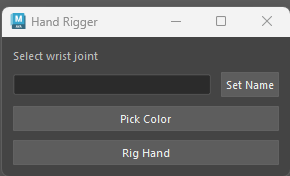

# Maya Hand Rigger Tool 

---------------------------------------------

This project is a Maya Tool created in Python using PySide6.
The tool creates FK finger controllers for a hand rig in Autodesk Maya.

The purpose of thye tool is to facilitate the process of rigging hands.

---------------------------------------------

# Features

* Automatic finger detection
* FK controller creation for each finger
* Color picker for controllers
* Organized controller hierarchy

----------------------------------------------

# How to Install

1. Download the project folder
2. Open Maya
3. Drag Install.mel into the Maya viewport
4. A shelf button called Hand Rigger will appear, click it to use it

-----------------------------------------------

# Requirements

* Autodesk Maya

* Pyside6

* Finger root joints should follow the naming convention: _01

For example:

* index_01
* middle_01
* ring_01
* pinky_01

-----------------------------------------------

# How to Use

1. Click on the Hand Rigger button
2. Select the wrist joint of the hand skeleton
3. Choose a name snd click on the "Set Name" button
4. (Optional) Pick a color for the controllers.
5. Press the "Rig Hand" button.